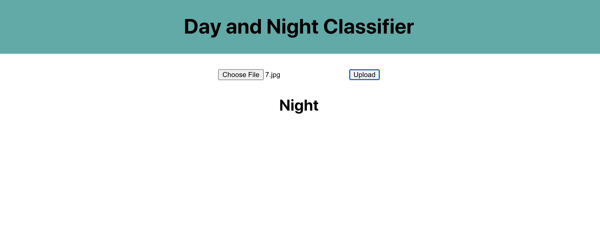

In the project directory, you can run:

For frontend
### `npm install`
### `npm start`

For backend, go to ./backend directory then run
For python you need to install cv2

### `python3 back.py`

# ScreenShot

  

